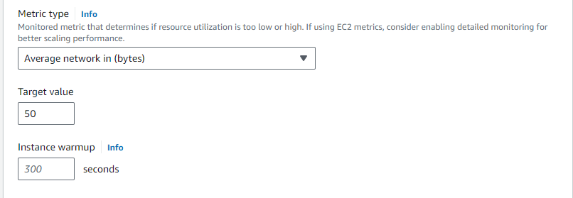
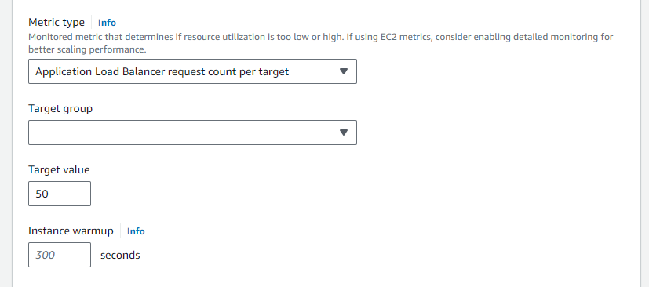

Create lunch template
provide guidance to help me set up templat
choose the ami
add a security group

 Amazon EC2 Auto Scaling creates and manages the CloudWatch alarms that trigger scaling events when the metric 
 deviates from the target. This is similar to how a thermostat maintains a target temperature.
 
 For example, let's say that you currently have an application that runs on two instances,
 and you want the CPU utilization of the Auto Scaling group to stay at around 50 percent when the load on the 
 application changes. This gives you extra capacity to handle traffic spikes without maintaining an excessive 
 number of idle resources.

You can meet this need by creating a target tracking scaling policy that targets an average CPU utilization of
50 percent. Then, your Auto Scaling group will scale out (increase capacity) when CPU exceeds 50 percent to handle 
increased load. It will scale in (decrease capacity) when CPU drops below 50 percent to optimize costs during periods 
of low utilization.

## Multiple target tracking scaling policies

To help optimize scaling performance, you can use multiple target tracking scaling policies together, 
provided that each of them uses a different metric. For example, utilization and throughput can influence each other.
Whenever one of these metrics changes, it usually implies that other metrics will also be impacted. 
The use of multiple metrics therefore provides additional information about the load that your Auto Scaling group is
under and improves decision making when determining how much capacity to add to your group.

The intention of Amazon EC2 Auto Scaling is to always prioritize availability, so its behavior differs depending 
on whether the target tracking policies are ready for scale out or scale in. It will scale out the Auto Scaling group
if any of the target tracking policies are ready for scale out, but will scale in only if all of the
target tracking policies (with the scale-in portion enabled) are ready to scale in.

## Choose metrics

You can create target tracking scaling policies with either predefined metrics or custom metrics.

When you create a target tracking scaling policy with a predefined metric type, you choose one metric
from the following list of predefined metrics:

ASGAverageCPUUtilization—Average CPU utilization of the Auto Scaling group.

ASGAverageNetworkIn—Average number of bytes received by a single instance on all network interfaces.

ASGAverageNetworkOut—Average number of bytes sent out from a single instance on all network interfaces.

ALBRequestCountPerTarget—Average Application Load Balancer request count per target.

### Define instance warm-up time

